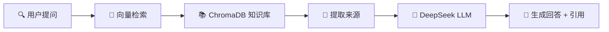

# 🛡️ 安全知识库 RAG 系统

<div align="center">


**基于 OWASP Top 10 与 MITRE ATT&CK 的网络安全智能问答平台**

*RAG · LLM · 向量检索 · 攻防知识库*

[](https://python.org)
[](https://fastapi.tiangolo.com)
[](https://react.dev)
[](https://docker.com)
[](LICENSE)

</div>

---

## 📖 项目简介

**安全知识库 RAG 系统**是一个面向网络安全领域的智能问答平台。它结合了 **RAG（检索增强生成）** 技术、**OWASP Top 10 漏洞数据**和 **MITRE ATT&CK 攻击框架**，能够为安全研究人员、渗透测试工程师和安全运维团队提供专业、可溯源的安全知识解答。

核心工作流程：



## ✨ 功能特性

| 功能                   | 描述                                                       |
| ---------------------- | ---------------------------------------------------------- |
| 🔐 **JWT 登录认证**     | 前端登录页面 + JWT Token 验证，保护 API 接口安全           |
| 🧠 **RAG 智能问答**     | 基于向量检索增强生成，回答更准确、更专业                   |
| 📎 **来源溯源**         | 每条回答标注参考来源（漏洞编号 / ATT&CK ID），可验证可追溯 |
| 📊 **Token 消耗统计**   | 可视化展示每次问答的 Token 消耗和检索到的文档块数量        |
| 🌐 **OWASP Top 10**     | 涵盖 OWASP Top 10 常见 Web 漏洞，含详细防御方案            |
| 🎯 **MITRE ATT&CK**     | 内置 ATT&CK 攻击技术知识库，覆盖主流攻击手法               |
| 🛡️ **渗透测试防御知识** | SQL注入、XSS、CSRF、SSRF 等常见漏洞防御方案                |
| 🎨 **深色科技风 UI**    | Tailwind CSS 暗色主题，专业安全工具风格界面                |
| 🐳 **一键 Docker 部署** | Docker Compose 编排，前后端一键启动                        |
| 🔄 **知识库热更新**     | 无需重启服务即可重新加载知识库                             |

## 🏗️ 技术栈

| 层级              | 技术             | 版本   | 用途                     |
| ----------------- | ---------------- | ------ | ------------------------ |
| **前端框架**      | React            | 18.x   | 用户界面构建             |
| **构建工具**      | Vite             | 5.x    | 前端开发和打包           |
| **CSS 框架**      | Tailwind CSS     | 3.4    | 原子化样式 / 深色主题    |
| **Markdown 渲染** | react-markdown   | 9.x    | AI 回答内容渲染          |
| **HTTP 客户端**   | Axios            | 1.6    | API 请求 + JWT 拦截器    |
| **后端框架**      | FastAPI          | 0.104  | 高性能异步 API 服务      |
| **向量数据库**    | ChromaDB         | 0.4    | 文档向量存储与相似度检索 |
| **嵌入模型**      | 智谱 Embedding-2 | -      | 文本向量化（1024 维）    |
| **大语言模型**    | DeepSeek Chat    | -      | 基于检索上下文的回答生成 |
| **认证方案**      | PyJWT            | 2.8    | JWT Token 签发与验证     |
| **数据获取**      | Requests         | 2.31   | MITRE CTI 数据拉取       |
| **容器化**        | Docker + Compose | -      | 一键部署与环境隔离       |
| **反向代理**      | Nginx            | Alpine | 前端静态资源 + API 代理  |

## 🖼️ 项目截图

> *以下为截图预留位置，请添加实际运行截图*

### 1. 登录页面

用户登录认证界面，支持 JWT Token 会话管理。


---

### 2. 主界面问答

登录后进入主界面，支持安全知识问答、Token 消耗统计、引用来源展示。


---

### 3. 引用来源溯源

点击"引用来源"按钮，可查看回答依据的知识来源，支持溯源验证。


## 🚀 快速开始

### 前置要求

- [Docker](https://docs.docker.com/get-docker/) 和 [Docker Compose](https://docs.docker.com/compose/install/)
- 或本地安装 Python 3.10+ 和 Node.js 18+

### 方式一：Docker Compose（推荐）

```bash
# 1. 克隆项目
git clone https://github.com/your-org/security-rag.git
cd security-rag

# 2. 配置环境变量
cp .env.example .env
# 编辑 .env，填入 DeepSeek API Key（必填）和智谱 API Key（可选）

# 3. 一键启动
docker compose up -d

# 4. 访问
# 前端: http://localhost:3000
# 后端 API 文档: http://localhost:8000/docs
```

### 方式二：本地开发

```bash
# ── 后端 ──
cd backend
pip install -r requirements.txt

# 获取知识库数据（首次运行）
python ../scripts/fetch_data.py

# 启动后端服务
python -m uvicorn app.main:app --host 0.0.0.0 --port 8000 --reload

# ── 前端（新终端）──
cd frontend
npm install
npm run dev

# 访问 http://localhost:3000
```

### 环境变量配置

复制 `.env.example` 为 `.env`，编辑以下配置：

```bash
# DeepSeek API Key（必需）
# 获取地址: https://platform.deepseek.com/api_keys
DEEPSEEK_API_KEY=sk-your-deepseek-key

# 智谱 API Key（可选，不填则使用哈希降级向量）
# 获取地址: https://open.bigmodel.cn/usercenter/apikeys
ZHIPU_API_KEY=your-zhipu-key

# 管理员账号（可选，默认值见下方说明）
ADMIN_USERNAME=hwj
ADMIN_PASSWORD=2004
```

## 🔑 默认登录账号

| 配置项 | 默认值 | 环境变量         |
| ------ | ------ | ---------------- |
| 用户名 | `hwj`  | `ADMIN_USERNAME` |
| 密码   | `2004` | `ADMIN_PASSWORD` |

> ⚠️ **安全提示**：生产环境请通过 `.env` 文件修改默认密码。

## 📂 项目结构

```
security-rag/
├── backend/                        # 后端服务
│   ├── Dockerfile                  # 后端 Docker 镜像
│   ├── requirements.txt            # Python 依赖
│   └── app/
│       ├── __init__.py
│       ├── main.py                 # FastAPI 主入口 + 路由 + JWT 中间件
│       ├── config.py               # 环境变量配置
│       ├── models.py               # Pydantic 数据模型
│       ├── rag_engine.py           # RAG 核心引擎 (检索 + 生成)
│       ├── embedder.py             # 智谱 Embedding 适配器
│       ├── prompts.py              # LLM Prompt 模板
│       └── data/
│           └── knowledge_raw.txt   # 知识库纯文本（自动生成）
│
├── frontend/                       # 前端应用
│   ├── Dockerfile                  # 前端多阶段构建 (Node + Nginx)
│   ├── nginx.conf                  # Nginx 反向代理配置
│   ├── package.json                # Node 依赖
│   ├── vite.config.js              # Vite 配置 (含 API 代理)
│   ├── tailwind.config.js          # Tailwind 深色主题配置
│   ├── index.html                  # HTML 入口
│   └── src/
│       ├── main.jsx                # React 入口 (路由/认证状态)
│       ├── App.jsx                 # 主应用 (聊天界面)
│       ├── Login.jsx               # 登录页面
│       └── index.css               # 全局样式 + 动画
│
├── scripts/                        # 工具脚本
│   ├── fetch_data.py               # 知识库数据获取 (OWASP + ATT&CK)
│   └── init_db.py                  # 数据库初始化 (获取 → 加载 → 测试)
│
├── data/
│   └── chroma_db/                  # ChromaDB 持久化目录（自动生成）
│
├── docker-compose.yml              # Docker Compose 编排文件
├── .env.example                    # 环境变量模板
├── .gitignore                      # Git 忽略规则
└── README.md                       # 项目文档（本文件）
```

## 📡 API 接口

### 公开接口

| 方法   | 路径              | 说明                     |
| ------ | ----------------- | ------------------------ |
| `GET`  | `/`               | 服务健康状态             |
| `POST` | `/api/auth/login` | 用户登录，返回 JWT Token |

### 认证接口（需 Bearer Token）

| 方法   | 路径           | 说明               |
| ------ | -------------- | ------------------ |
| `POST` | `/api/query`   | 安全知识问答       |
| `POST` | `/api/reload`  | 重新加载知识库     |
| `GET`  | `/api/sources` | 列出知识库全部来源 |

### 示例请求

```bash
# 登录获取 Token
curl -X POST http://localhost:8000/api/auth/login \
  -H "Content-Type: application/json" \
  -d '{"username": "hwj", "password": "2004"}'

# 使用 Token 进行问答
curl -X POST http://localhost:8000/api/query \
  -H "Authorization: Bearer <your-token>" \
  -H "Content-Type: application/json" \
  -d '{"text": "什么是SQL注入？如何防御？"}'
```

### 回答示例

```json
{
  "answer": "SQL注入是一种代码注入技术，攻击者通过在输入字段中插入恶意SQL语句...",
  "sources": ["CVE-2024-12345", "ATT&CK T1190"],
  "chunks_count": 3
}
```

## 🔧 环境变量参考

| 变量名               | 默认值                         | 必须 | 说明                    |
| -------------------- | ------------------------------ | :--: | ----------------------- |
| `DEEPSEEK_API_KEY`   | -                              |  ✅   | DeepSeek API 密钥       |
| `ZHIPU_API_KEY`      | -                              |  ❌   | 智谱 Embedding API 密钥 |
| `ADMIN_USERNAME`     | `hwj`                          |  ❌   | 管理员登录用户名        |
| `ADMIN_PASSWORD`     | `2004`                         |  ❌   | 管理员登录密码          |
| `JWT_SECRET`         | `security-rag-secret-key-2024` |  ❌   | JWT 签名密钥            |
| `JWT_EXPIRY_HOURS`   | `24`                           |  ❌   | Token 有效期（小时）    |
| `CHROMA_PERSIST_DIR` | `./data/chroma_db`             |  ❌   | ChromaDB 数据目录       |
| `HOST`               | `0.0.0.0`                      |  ❌   | 后端监听地址            |
| `PORT`               | `8000`                         |  ❌   | 后端监听端口            |

## 🛠️ 知识库数据

本项目内置以下安全知识：

| 数据来源         | 说明                                           | 更新方式                     |
| ---------------- | ---------------------------------------------- | ---------------------------- |
| **OWASP Top 10** | Web 应用十大安全风险，含详细漏洞描述与防御方案 | 运行 `scripts/fetch_data.py` |
| **MITRE ATT&CK** | 攻击技术框架，覆盖 14 个战术分类               | 运行 `scripts/fetch_data.py` |
| **渗透测试防御** | SQL注入、XSS、CSRF、SSRF、文件上传等防御方案   | 内置示例数据                 |

初始化知识库：

```bash
# 完整初始化：获取数据 → 加载向量库 → 测试查询
python scripts/init_db.py

# 仅获取数据
python scripts/fetch_data.py

# 重新加载知识库（调用 API）
curl -X POST http://localhost:8000/api/reload \
  -H "Authorization: Bearer <your-token>"
```

## 📄 许可证

本项目基于 [MIT License](LICENSE) 开源。

---

<div align="center">


**Made with ❤️ for Security Researchers**

*如有问题或建议，欢迎提交 Issue 或 Pull Request*

</div>
